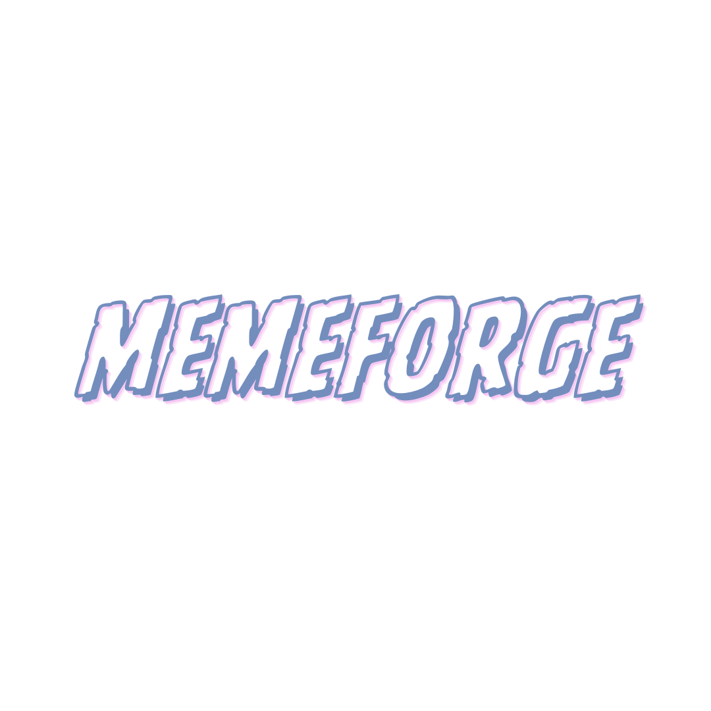

# MemeForge

Free cartoon crypto meme generator for the community. Create amazing memes without limits or complexity.



## Features

- **Pure Cartoon Style**: Every meme is generated in consistent cartoon crypto style (Pepe, Wojak, classic meme aesthetics)
- **Character Builder**: Create custom characters and use them consistently across all generations
- **Custom Assets**: Upload your coin logo, project mascot, or any custom asset
- **Lightning Fast**: Instant generation with OpenAI DALL-E
- **100% Free**: 5 generations/day as guest, 50/day with free account
- **Community Gallery**: Share your creations and get inspired

## Tech Stack

- **Framework**: Next.js 15 (App Router)
- **Language**: TypeScript
- **Styling**: Tailwind CSS
- **Database**: Vercel Postgres
- **AI**: OpenAI DALL-E 3
- **Auth**: JWT with bcrypt
- **Deployment**: Vercel

## Getting Started

### Prerequisites

- Node.js 18+ installed
- OpenAI API key
- Vercel account (for deployment)

### Installation

1. Clone the repository:
```bash
git clone https://github.com/m2protocol/memeforge.git
cd memeforge
```

2. Install dependencies:
```bash
npm install
```

3. Set up environment variables:
Create a `.env.local` file in the root directory:
```env
OPENAI_API_KEY=your_openai_api_key_here
JWT_SECRET=your_random_secret_key_here
POSTGRES_URL=your_postgres_connection_string
```

4. Set up the database:
Run the SQL schema from `lib/db/schema.sql` in your Postgres database.

5. Run the development server:
```bash
npm run dev
```

6. Open [http://localhost:3000](http://localhost:3000) in your browser.

## Deployment to Vercel

1. Push your code to GitHub
2. Import the project in Vercel
3. Add environment variables:
   - `OPENAI_API_KEY`
   - `JWT_SECRET`
   - Vercel Postgres variables (auto-generated)
4. Deploy!

## Database Setup

The app uses Vercel Postgres. To set up:

1. In Vercel dashboard, go to Storage
2. Create a new Postgres database
3. Copy the connection strings to your environment variables
4. Run the schema from `lib/db/schema.sql`:
   - Go to the Vercel Postgres Query tab
   - Paste and execute the schema

## Features Roadmap

### v1.0 (Current)
- ✅ Basic meme generation
- ✅ User authentication
- ✅ Rate limiting (5/day guest, 50/day registered)
- ✅ Community gallery
- ✅ Dashboard
- ✅ Prompt engineering for cartoon style

### v1.1 (Coming Soon)
- 🔄 Character Builder
- 🔄 Asset Upload system
- 🔄 Advanced prompt templates
- 🔄 Meme collections

### v2.0 (Future)
- 📋 Batch generation
- 📋 API access
- 📋 Discord bot integration
- 📋 Meme editor

## Contributing

This is an open-source project! Contributions are welcome.

1. Fork the repository
2. Create your feature branch (`git checkout -b feature/AmazingFeature`)
3. Commit your changes (`git commit -m 'Add some AmazingFeature'`)
4. Push to the branch (`git push origin feature/AmazingFeature`)
5. Open a Pull Request

## License

This project is open source and available under the MIT License.

## Credits

Created by [M2 Protocol](https://github.com/m2protocol)

Built with:
- Next.js
- OpenAI DALL-E
- Vercel
- Love for the crypto community

## Support

If you have any questions or need help:
- Open an issue on GitHub
- Check the community gallery for inspiration
- Join our community discussions

---

**MemeForge** - Creating epic crypto memes, one generation at a time! 🚀🎨
